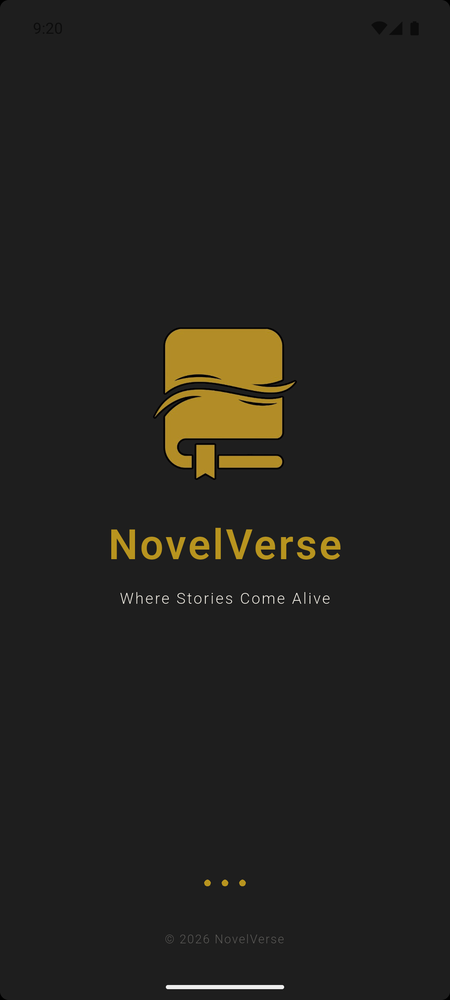
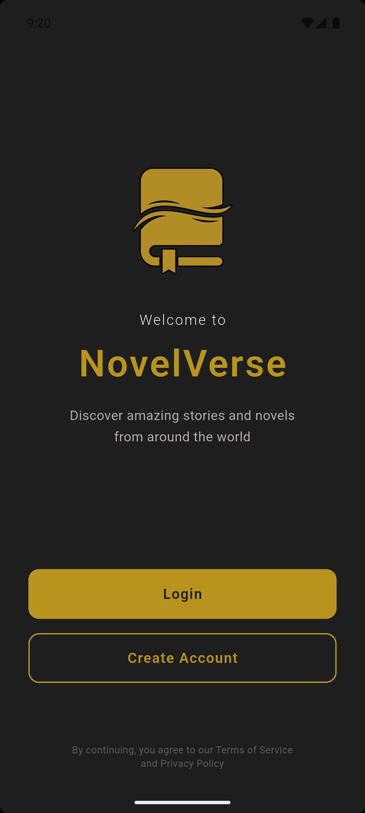
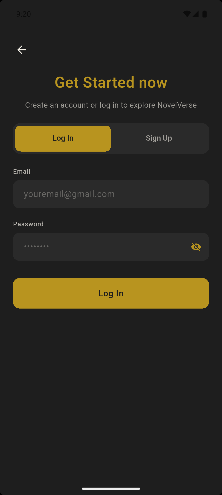
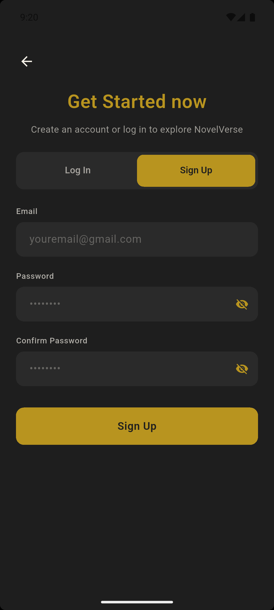
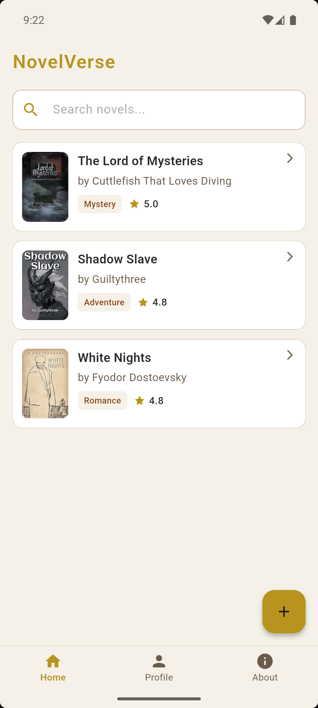
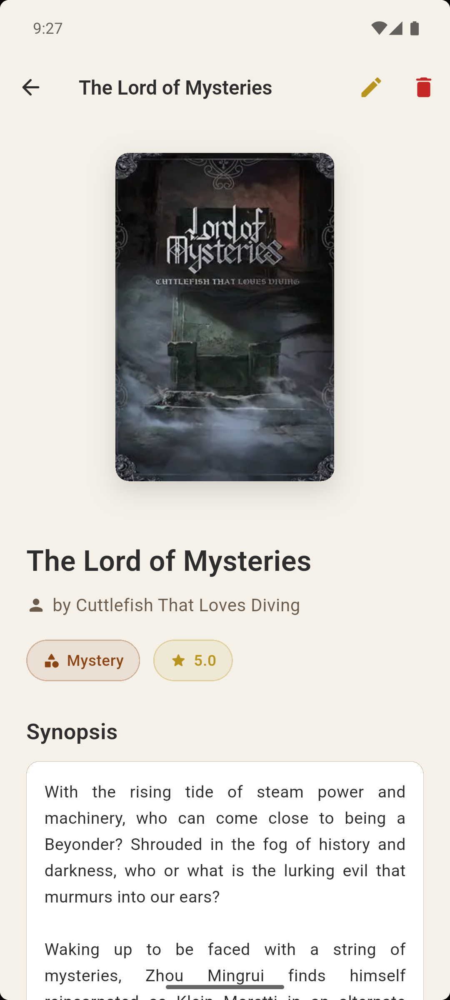
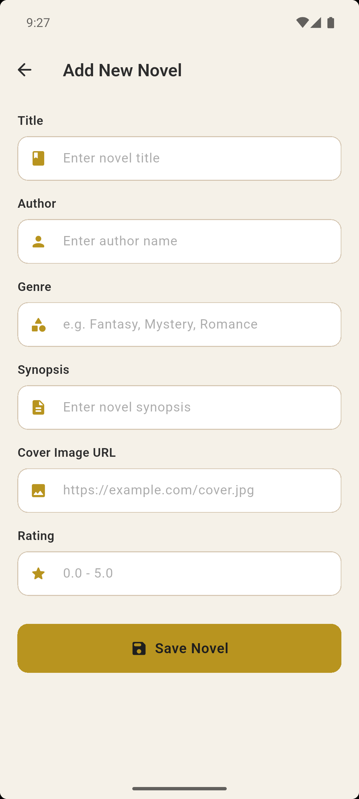
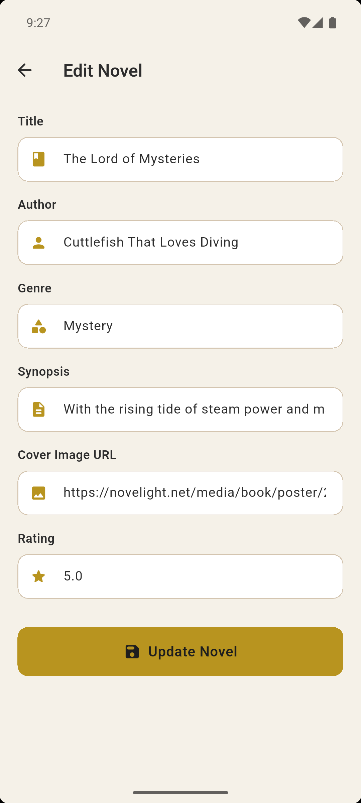
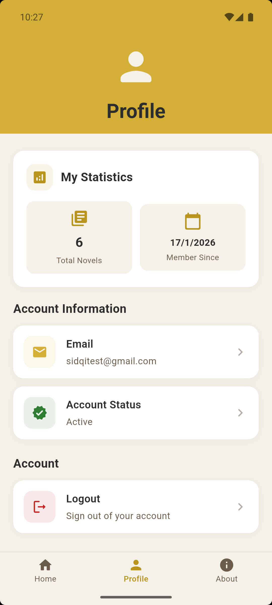

<div align="center">
  
  
  # NovelVerse
  
  **Discover and share your favorite novels**
  
  [](https://flutter.dev/)
  [](https://dart.dev/)
  [](https://firebase.google.com/)
  [](https://opensource.org/licenses/MIT)
  [](https://www.android.com/)
  
  [](https://github.com/SidqiRaafi/NovelVerse/stargazers)
  [](https://github.com/SidqiRaafi/NovelVerse/network/members)
  [](https://github.com/SidqiRaafi/NovelVerse/issues)
  [](https://github.com/SidqiRaafi/NovelVerse/pulls)
  [](https://github.com/SidqiRaafi/NovelVerse/pulls)
  [](https://github.com/SidqiRaafi/NovelVerse/graphs/commit-activity)
  
  [Features](#features) • [Demo](#demo) • [Download](#download) • [Development](#development) • [Contributing](#contributing) • [License](#license)
  
</div>

---

## 📖 About

NovelVerse is a collaborative novel listing application that brings book enthusiasts together. Built with Flutter and Firebase, it provides a shared platform where users can add, discover, and manage their favorite novels. Different accounts, same listing - making it perfect for communities who want to curate and share their reading recommendations.

<a name="features"></a>
## ✨ Features

- 🔐 **User Authentication** - Secure login and registration system
- 📚 **Novel Management** - Add, edit, and delete novels with detailed information
  - Title, Author, Genre
  - Cover URL for visual appeal
  - Ratings and Synopsis
- 🔍 **Search Functionality** - Quickly find novels from the listing
- 👤 **Profile Management** - View account details, verification status, and logout
- ℹ️ **About Page** - Learn about the developers and the app
- 🌐 **Shared Database** - All users contribute to and view the same novel collection
- 📱 **Modern UI** - Clean and intuitive interface built with Flutter

<a name="demo"></a>
## 🎬 Demo

### Screenshots

<div align="center">
  
  
  
  
</div>

<div align="center">
  
  
  
</div>

<div align="center">
  
  
  
  
</div>

### Video Demo

<div align="center">
  <a href="https://www.youtube.com/watch?v=YOUR_VIDEO_ID">
    
  </a>
  <p><i>🎥 Click to watch the full demo video</i></p>
</div>

<a name="download"></a>
## 📥 Download

### For Users

Download the latest APK from the [Releases](https://github.com/SidqiRaafi/NovelVerse/releases) page.

**Requirements:**
- Android 8.0 (Oreo) or higher
- Minimum 50MB free storage
- Internet connection for Firebase services

**Installation:**
1. Download the latest `.apk` file from releases
2. Enable "Install from Unknown Sources" in your Android settings
3. Open the downloaded APK and follow the installation prompts
4. Launch NovelVerse and create your account!

<a name="development"></a>
## 🛠️ Development

### Prerequisites

- [Flutter SDK](https://flutter.dev/docs/get-started/install) (Latest stable version as of January 2026)
- [Dart SDK](https://dart.dev/get-dart) (Comes with Flutter)
- Android Studio / VS Code (or your preferred IDE)
- [Firebase Account](https://firebase.google.com/)
- Git

### Firebase Setup

1. **Create a Firebase Project**
   - Go to [Firebase Console](https://console.firebase.google.com/)
   - Create a new project or use an existing one

2. **Enable Authentication**
   - In Firebase Console, go to Authentication
   - Enable Email/Password sign-in method

3. **Setup Firestore Database**
   - Go to Firestore Database
   - Create a database (start in production mode or test mode)
   - Create a collection named `novels` with the following fields:
     ```
     - author (string)
     - coverUrl (string)
     - genre (string)
     - rating (number)
     - synopsis (string)
     - title (string)
     ```

4. **Download Configuration File**
   - Register your Android app in Firebase project settings
   - Download `google-services.json`
   - Place it in `android/app/` directory

### Local Setup

```bash
# Clone the repository
git clone https://github.com/SidqiRaafi/NovelVerse.git
cd NovelVerse

# Install dependencies
flutter pub get

# Run the app
flutter run
```

### Build APK

```bash
# Build release APK
flutter build apk --release

# Build split APKs per ABI (smaller file size)
flutter build apk --split-per-abi
```

The APK will be generated in `build/app/outputs/flutter-apk/`

## 🗂️ Project Structure

```
android/
├── app/
│   └── google-services.json        //ask maintainer  ✔️
│
assets/
├── logo/
│   └── logo.png                    //app logo        ✔️
│
├── demo/
│   ├── welcome.png                 //showcase welcome screen       ✔️
│   ├── login.png                   //showcase login screen         ✔️
│   ├── register.png                //showcase register screen      ✔️
│   ├── home1.png                   //showcase home screen          ✔️
│   ├── home2.png                   //showcase novel scren          ✔️
│   ├── home3.png                   //showcase add novel screen     ✔️
│   ├── home4.png                   //showcase edit novel screen    ✔️
│   ├── home5.png                   //showcase delete novel screen  ✔️
│   ├── profile.png                 //showcase profile screen       ✔️
│   └── about.png                   //showcase about app screen     ✔️
│
lib/
├── models/
│   ├── novel.dart                  //data novel    ✔️
│   └── user.dart                   //data user     ✔️
│
├── screens/
│   ├── auth/
│   │   ├── auth_page.dart          //form login dan register   ✔️
│   │   └── welcome_page.dart       //pilih login register      ✔️
│   │
│   ├── home/
│   │   ├── add_novel_page.dart     //form tambah novel         ✔️
│   │   ├── detail_page.dart        //detail novel              ✔️
│   │   ├── edit_novel_page.dart    //edit novel                ✔️
│   │   ├── list_page.dart          //list novel dan search     ✔️
│   │   └── main_page.dart          //navigasi                  ✔️
│   │
│   ├── profile/
│   │    └── about_page.dart         //info app dan dev          ✔️
│   │    └── profile_page.dart       //tentang user dan logout   ✔️
│   └── splash_screen.dart           //splash screen             ✔️
│
├── services/
│   ├── auth_service.dart           //Firebase Auth login dan Register      ✔️
│   └── firestore_service.dart      //CRUD Novel                            ✔️
│
├── widgets/
│   └── auth_wrapper.dart           //Persistent Login System               ✔️
│
├── firebase_options.dart           //ask maintainer                        ✔️
└── main.dart                       //entry point                           ✔️
```

<a name="contributing"></a>
## 🤝 Contributing

We welcome contributions from the community! Here's how you can help:

1. **Fork the repository**
2. **Create a feature branch**
   ```bash
   git checkout -b feature/AmazingFeature
   ```
3. **Commit your changes**
   ```bash
   git commit -m 'Add some AmazingFeature'
   ```
4. **Push to the branch**
   ```bash
   git push origin feature/AmazingFeature
   ```
5. **Open a Pull Request**

### Contribution Guidelines

- Follow the existing code style and structure
- Write clear, descriptive commit messages
- Test your changes thoroughly before submitting
- Update documentation if needed
- Be respectful and constructive in discussions

## 🚀 Future Plans

- 📖 Add ability to upload and read novel chapters
- 🔖 Bookmark favorite novels
- ⭐ User reviews and ratings system
- 🔔 Notifications for new additions
- 🍎 iOS platform support
- 🌙 Dark mode theme

<a name="contributors"></a>
## 👥 Contributors

Meet the team behind NovelVerse:

<table>
  <tr>
    <td align="center">
      <a href="https://github.com/SidqiRaafi">
        <br />
        <sub><b>Sidqi Raafi</b></sub>
      </a><br />
      <sub>23552011395</sub><br />
      <sub>Lead Developer & Maintainer</sub>
    </td>
    <td align="center">
      <a href="https://github.com/Parzival-Desu">
        <br />
        <sub><b>Rayhan Khadafi</b></sub>
      </a><br />
      <sub>23552011302</sub><br />
      <sub>Authentication & Logo Designer</sub>
    </td>
    <td align="center">
      <a href="https://github.com/Faichese">
        <br />
        <sub><b>Faisal</b></sub>
      </a><br />
      <sub>23552011303</sub><br />
      <sub>User & Profile Firebase Integration</sub>
    </td>
    <td align="center">
      <a href="https://github.com/rynrifn">
        <br />
        <sub><b>Rifki Febrian</b></sub>
      </a><br />
      <sub>23552011430</sub><br />
      <sub>Splashscreen & About Implementation</sub>
    </td>
  </tr>
</table>

<a name="license"></a>
## 📄 License

This project is licensed under the MIT License - see the [LICENSE](LICENSE) file for details.

## 📞 Contact & Support

If you have any questions, suggestions, or issues:

- 🐛 [Report a Bug](https://github.com/SidqiRaafi/NovelVerse/issues)
- 💡 [Request a Feature](https://github.com/SidqiRaafi/NovelVerse/issues)
- 📧 Contact the maintainers through GitHub

## ⭐ Show Your Support

If you find NovelVerse helpful, please consider giving it a star! It helps others discover the project and motivates us to keep improving it.

---

<div align="center">
  Made with Flutter 💙
  <br/>
  <sub>Built with passion for book lovers everywhere</sub>
</div>
